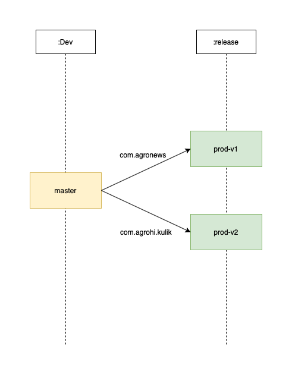
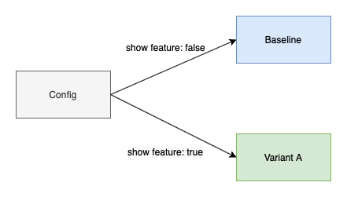
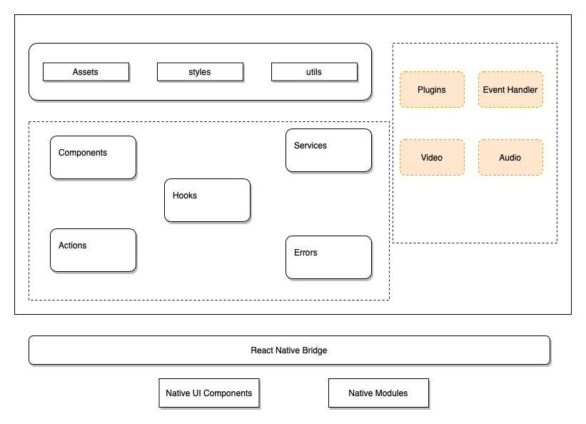

# agro


### App

[App](https://play.google.com/store/apps/details?id=com.agrohi.kulik)

Run in debug

    rna

Run in release mode

    rna --variant=release

Note: `rna` is the alias for `npx react-native run-android`

Ubuntu script load error
    npx react-native start

Bundle creation

    ./gradlew bundleRelease

OTA updates

    expo updates is removed due to slowness and blank screen while opening the app

Over the air updates

    expo publish --release-channel prod-v2

History

    expo publish:history --release-channel prod-v2 --platform android --count 10

Rollback

    expo publish:rollback --release-channel prod-v2 --sdk-version 40.0.0

History

    expo publish:history --release-channel prod-v2 --platform android --sdk-version 40.0.0 --count=10

Publish Set

    expo publish:set --release-channel prod-v2 --publish-id

Watermark

    ffmpeg -i input.mp4 -i logo.png \
    -filter_complex "overlay='if(gte(t,0), -w+(t+1)*200, NAN)':(main_h-overlay_h)" output.mp4

Install bundle

    bundletool build-apks --bundle=android/app/build/outputs/bundle/release/app-release.aab --output=out/my_app.apks

    bundletool install-apks --apks=out/my_app.apks

APK

    adb install android/app/build/outputs/apk/release/app-x86-release.apk

### Scripts

    zsh ./scripts/installBundle.sh

### Progaurd

Progaurd is enabled. It reduces the apk size relatively by 5mb. Config is moved from .env due to error.

### JS Bundle Visualizer

    ./node_modules/.bin/react-native-bundle-visualizer

### Splash Screen

```sh
yarn run configure-splash-screen -p android --background-color "#fac030" -i './app/assets/images/banner.png' -r 'cover' --dark-mode-background-color "#fac030" --dark-mode-image-path './app/assets/images/banner.png' --status-bar-style "light-content" --status-bar-hidden
```

### Deployment divergence




### Experiments



### Application Structuring




 ./gradlew assembleDebug --stacktrace
